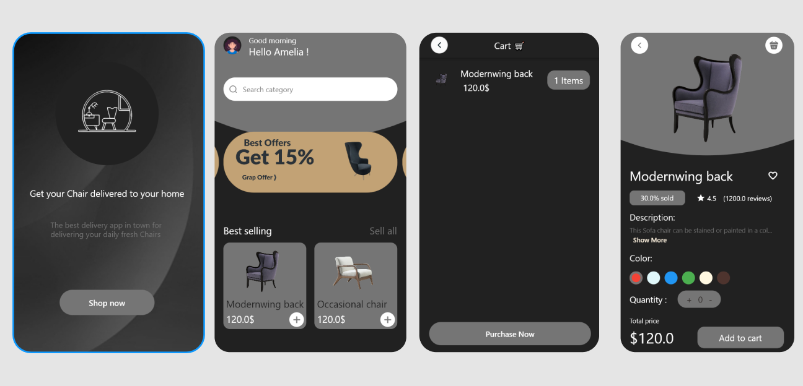

# Title: ChairEase - Your Ultimate Chair Shopping Experience

# Description
ChairEase is a cutting-edge e-commerce application designed to revolutionize the way you shop for chairs. Built using the powerful Flutter framework and enhanced with the efficient state management capabilities of GetX, ChairEase offers a seamless and intuitive platform for users to explore, customize, and purchase their ideal chairs.

## Screenshot 📷
  

# ecomapp

A new Flutter project.

## Getting Started

This project is a starting point for a Flutter application.

A few resources to get you started if this is your first Flutter project:

- [Lab: Write your first Flutter app](https://docs.flutter.dev/get-started/codelab)
- [Cookbook: Useful Flutter samples](https://docs.flutter.dev/cookbook)

For help getting started with Flutter development, view the
[online documentation](https://docs.flutter.dev/), which offers tutorials,
samples, guidance on mobile development, and a full API reference.
